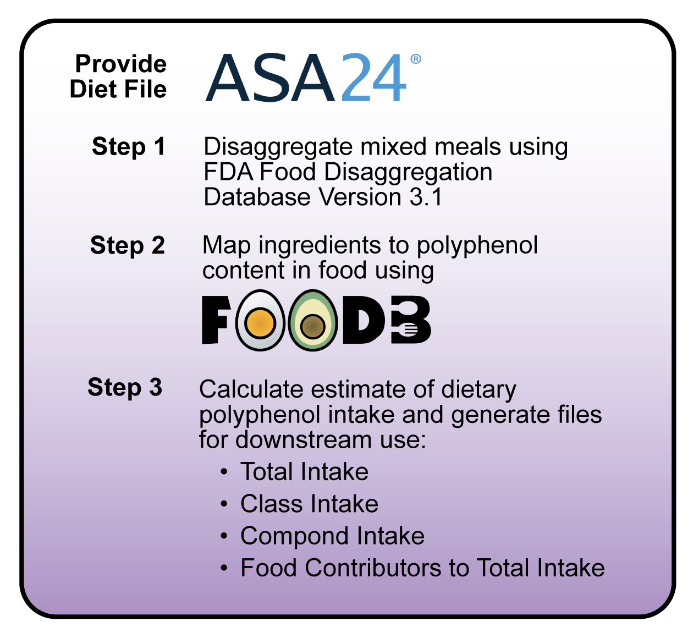

# Polyphenol Intake Estimation Pipeline

**Developed by**: Stephanie M.G. Wilson  
**Last Updated**: November 20, 2025  

## About
This repository contains scripts to automate the estimation of dietary polyphenol intake and calculation of the dietary inflammatory index from ASA24 or NHANES diet recalls. 

In brief, reported foods in ASA24 are disaggregated into their underlying ingredients using the FDA Food Disaggregation Database, mapped to their food equivalent in FooDB, and estimates polyphenol intake at various levels of resolution (total, class, compound). Outputs are provided for each resolution of polyphenol intake for users to use for their separate analyses. 

<figure>
  
</figure>

## Software
- **R** - download R from [CRAN](https://cran.rstudio.com/)
- **RStudio** - download Rstudio, the graphical interface for R, free for your operating system on [Posit](https://posit.co/download/rstudio-desktop/)

## Required Files
        
| Inputs      | Provided | About   |
|------------ |--------- |---------|
| ASA24 Study Data   | No     	| **Pipeline users must first download their ASA24 Items Analysis File from the ASA24 Researcher Site.** Note: Current pipeline requires each participant to have at least two recalls. 	|
| FDA Food Disaggregation Database V 3.1   | Yes  |   FDA's Food Disaggregation Database contains Ingredients and their percentages within FNDDS food codes. |
| FooDB food polyphenol content  | Yes      	|   Contains polyphenol content in foods. Polyphenols were determined based off structure (an aromatic ring with at least two hydroxyl groups) with 9 compounds manually added to better reflect microbial enzyme substrates.   |
| FooDB polyphenol list   | Yes      	| List of 3072 polyphenols. File includes FooDB compound ID, compound name, SMILES, InChI key, and taxonomic class. Taxonomic class is from ClassyFire, an automated chemical taxonomic classification application based on chemical structure.  |
| FDA-FDD v3.1 to FooDB Mapping   | Yes      	|  Linkage between FDA FDD Version 3.1 Ingredients to FooDB orig_food_common_name  |
| FooDB eugenol content | Yes | Contains eugenol content in foods. |
| FooDB polyphenol subclasses - DII | Yes | FooDB polyphenol taxonomic classes relevant to calculating the Dietary Inflammatory Index. |

## Releases
- November 20, 2025 - Tutorial Draft Release

## Contact
For questions, troubleshooting, and feedback during testing, please contact smgwilson@ucdavis.edu.