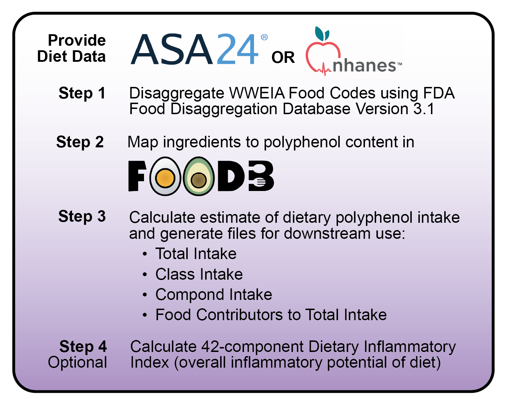

# Polyphenol Estimator

This repository contains scripts to automate the estimation of dietary polyphenol intake at different resolutions (total, class, compound-level) and calculation of the dietary inflammatory index from ASA24 recalls, ASA24 records, and NHANES WWEIA recalls.

### Releases
- November 20, 2025 - Tutorial Draft Release
- May 13, 2026 - Polyphenol Estimator & Tutorial 1st Release

## How it Works

<figure>
  
</figure>

## Get Started
Do you have ASA24 or AMPM (NHANES) data that you would like to obtain polyphenol estimates from? Check out our tutorial (complete with start-up guide) to get started - [Polyphenol Estimator Tutorial](https://swi1.github.io/polyphenol_estimator/). 

Prerequisite: R and R Studio Installed

In order to run Polyphenol Estimator, you need access to both <a href = "https://cran.rstudio.com/R" > R </a> and <a href = "https://posit.co/download/rstudio-desktop/"> R Studio </a>. If you have not already downloaded these two programs, this 6-minute video from Alex The Analyst will walk you through the download process as well give you a brief introduction of the user interface. 
  <ul>
    <li>
      <a href="https://youtu.be/TsnGd6p9oTk?si=Ow1xiNXAt-_Cb9dj">
        Installing R and R Studio
      </a>
    </li>
  </ul>

## Required Inputs
Polyphenol Estimator can work with the following diet input files:
 - ASA24 Recall or Records Items Files
 - WWEIA, NHANES "Individual Foods" Recall Files
## Provided Files
        
| Inputs      |  About   |
|------------ |--------- |
| FDA Food Disaggregation Database V 3.1   |   The [FDA Food Disaggregation Database](https://doi.org/10.1080/19440049.2024.2393789) contains Ingredients and their percentages within FNDDS food codes. |
| FooDB food polyphenol content  | Contains polyphenol content in foods from [FooDB](https://foodb.ca/). Polyphenols were determined based off structure (an aromatic ring with at least two hydroxyl groups) with 9 compounds manually added to better reflect microbial enzyme substrates.   |
| FooDB polyphenol list   | List of 3072 polyphenols. File includes FooDB compound ID, compound name, SMILES, InChI key, and taxonomic class. Taxonomic class is from [ClassyFire](https://doi.org/10.1186/s13321-016-0174-y), an automated chemical taxonomic classification application based on chemical structure.  |
| FDA-FDD v3.1 to FooDB Mapping   | Linkage between FDA FDD Version 3.1 Ingredients to FooDB orig_food_common_name  |
| FooDB eugenol content | Contains eugenol content in foods from [FooDB](https://foodb.ca/). |
| FooDB polyphenol subclasses - DII | FooDB polyphenol taxonomic classes relevant to calculating the Dietary Inflammatory Index. |

