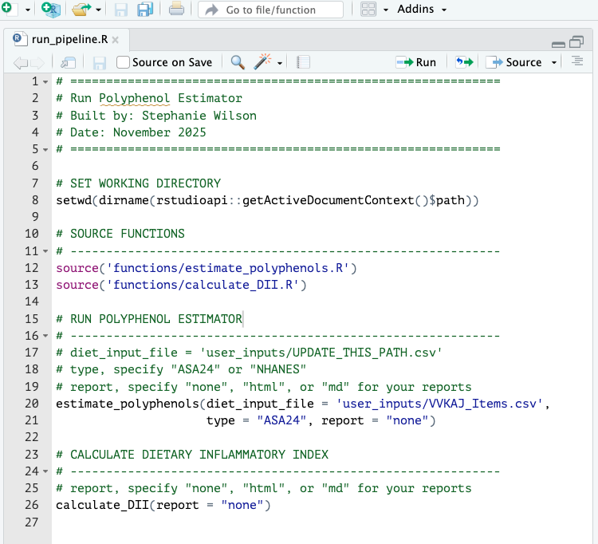
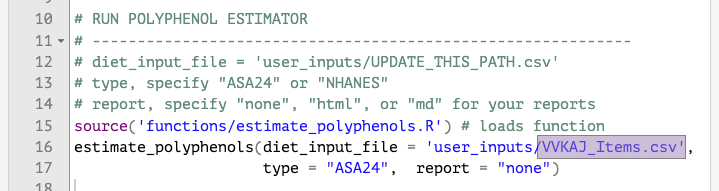

# Polyphenol Estimator

This start guide shows you how to take your ASA24 or NHANES dietary data and estimate polyphenol intake using [FooDB](https://foodb.ca/) and calculate the dietary inflammatory index [(Shivapppa et al. 2013)](https://doi.org/10.1017/S1368980013002115). Example ASA24 data, borrowed from the [DietDiveR Repository](https://computational-nutrition-lab.github.io/DietDiveR/), is provided for you to test. Check out [the example file here](https://github.com/SWi1/polyphenol_estimator/blob/main/user_inputs/VVKAJ_Items.csv) to see the input structure required for Polyphenol Estimator.

<details>
<summary>Prerequisite: R and R Studio Installed</summary>
In order to run Polyphenol Estimator, you need access to both R and R Studio. If you have not already downloaded these two programs, this 6-minute video from Alex The Analyst will walk you through the download process as well give you a brief introduction of the user interface. 
  <ul>
    <li>
      <a href="https://youtu.be/TsnGd6p9oTk?si=Ow1xiNXAt-_Cb9dj">
        Installing R and R Studio
      </a>
    </li>
  </ul>
</details>


## Let's Get Started!

### 1. Download the entire repository directly [here](https://github.com/SWi1/polyphenol_estimator/archive/refs/heads/main.zip) then unzip the folder. 
The repository contains files and scripts used in the tutorial.

###  2. Open 'run_pipeline.R' in RStudio.


### 3. Update `diet_input_file` path if not using the demo ASA24 data.


### 4. Run the scripts.
In our usage case of ASA24 data, we have specified that the input is ASA24 data and that we would not like a report of what happens in each step. After you've run `estimate_polyphenols`, you can also run `calculate_DII`. Calculation of DII is *optional*. The function automatically detects whether you've run ASA24 or NHANES data, you only need to specify if you would like to see what happens in each script.

### 5. Check out the resulting files in your output directory!
Find more information about expected outputs for `estimate_polyphenols` and `calculate_DII` at the following link: [Polyphenol Estimator Output Information](https://swi1.github.io/polyphenol_estimator/webpages/outputs.html)

<details>
<summary>Reports: A reader-friendly way to view scripts</summary>
  <ul>
  If you opt to generate md or html reports, then a readable report of each script used will be placed into your reports folder. You can preview the latest reports generated by navigating to pages under "Polyphenol Estimator" and "DII Calculation" in your sidebar. Users may find report generation helpful to keep a record of which scripts were used as the tool periodically will be updated.
  </ul>
</details>

## Want to test NHANES data instead?
Polyphenol Estimator can also be run on WWEIA, NHANES data. To get users started, we have provided data prepration instructions to process dietary data from the two dietary interviews in NHANES 2021-2023. 

1. Open "preparing_diet_data_NHANES.Rmd" which is located in the directory shown below. The script can also be previewed on the tutorial without opening R Studio - ["Tutorial, Preparing Diet Data - NHANES diet recalls"](https://swi1.github.io/polyphenol_estimator/webpages/preparing_diet_data_NHANES.html)

    ```
    polyphenol_estimator-main/
      ├── R/   
      │   ├── scripts/
      │       └── preparing_diet_data_NHANES.Rmd
    ``` 
2. Return to run_pipeline.R and within `estimate_polyphenols`, update `diet_input_file` with the NHANES diet output file name. 
3. In `estimate_polyphenols`, change type to "NHANES"
4. Run the script. 