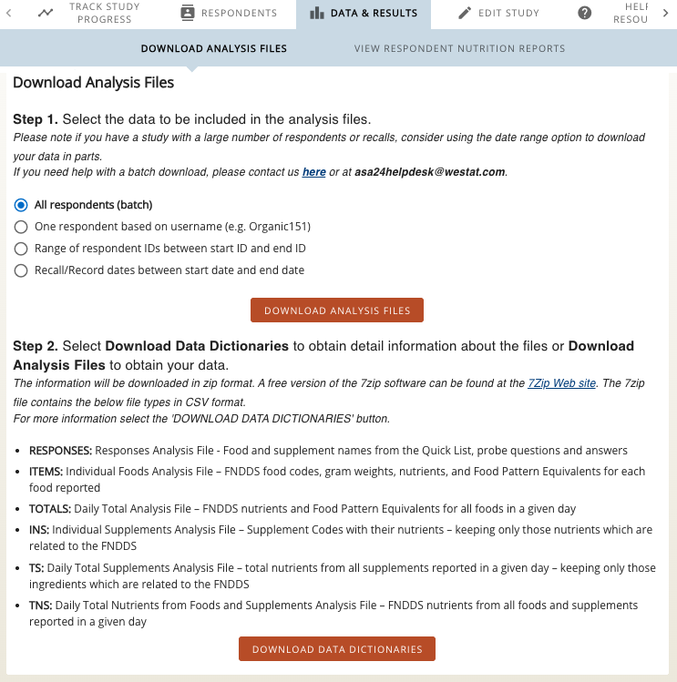

# Preparing ASA24 Dietary Data
## Use demo data

An example ASA24 Recall Items File is provided from [DietDiveR](https://github.com/computational-nutrition-lab/DietDiveR). You can also use this to examine the format of the necessary input file and run Polyphenol Estimator before using your own data.

## Use your own ASA24 data
### 1.  Download the ASA24 Items file from all respondents in your study on the [ASA24 researcher website](https://asa24.nih.gov/researcher/#/login).

### 2. Perform dietary quality control checks. 
  - Polyphenol Estimator will automatically include complete entries (`RecallStatus`==5 or `Record_Status`==5).
  - **Additional dietary quality control checks** should be done before running Polyphenol Estimator without disturbing the data structure. The CDC provides [ASA24 quality control guidelines](https://epi.grants.cancer.gov/asa24/resources/cleaning.html), which covers missing data, text entries, outlier review, and duplicate entries.

### 3. Come back to run_pipeline.R and update `diet_input_file` with your own ASA24 file path.
  - Polyphenol Estimator will run the example ASA24 file **unless** you change the input data.

### 4. Run Polyphenol Estimator for your ASA24 data. 
  - See our [Start Guide](https://swi1.github.io/polyphenol_estimator) for instructions.